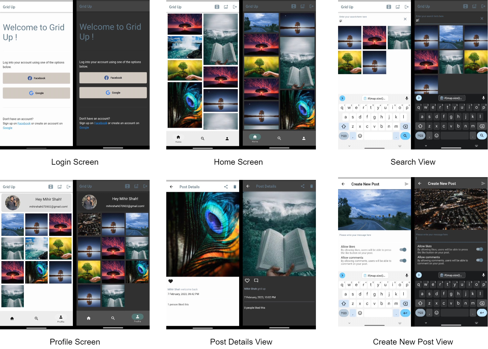

# 
 </img> Grid Up! 

 
  A place to Grid Up all your <i>memories</i> to world.
   
  

https://user-images.githubusercontent.com/85797145/218247477-4c34ecb5-0f4b-4819-aa04-52dbc8afb953.mp4

## Table of Content
* [Architecture](https://github.com/ms070902/grid_up/blob/main/README.md#architecture)
* [/Design](https://github.com/ms070902/grid_up/blob/main/README.md#design)
* [Technologies Used](/Technologiesused)
* [Author](/Author)
* [Credit](/Credit)

### Architecture
* The app is build using Riverpod 2.x State Management System in Flutter and uses Firebase for storage of media files, post of users, comments, and likes.
* It also uses FirebaseAuth for google and facebook sign in to the app.
* The detailed architecture of complete working of the application is demonstrated below: 
 
</img>

### Design
 
</img>

### Technologies Used
* Architecture Design
  * Drawio
* Icon Design
  * Canva
* Frontend
  * Flutter (Riverpod 2.x)
* Backend
  * Firebase Storage (for storing media files and their thumbnails)
  * Firebase Firestore (keep a track of users, their posts as well as likes and commenst on a post)
  * Firebase Auth (for google and facebook login)

### Author
* Mihir Shah
  * [LinkedIn](https://www.linkedin.com/in/ms070902/)
  * [Twitter](https://twitter.com/__ms_07)

### Credit
* Roshan Bhagchandani
  * Icon designing
     * [LinkedIn](https://www.linkedin.com/in/roshan-bhagchandani-0a1913216)
     * [GitHub](https://github.com/Roshan-Bhagchandani)
